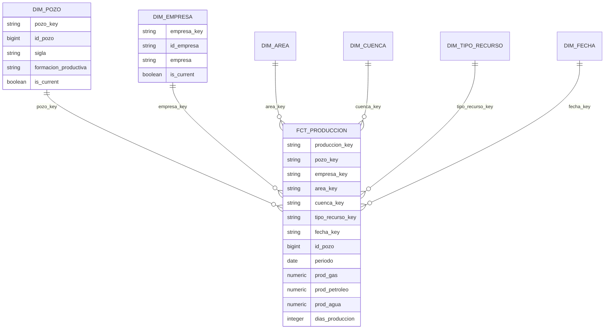

# Modelo de datos gold

La capa gold publica un modelo estrella para analizar produccion mensual de pozos no
convencionales. Silver sigue siendo la capa de limpieza y tipado; gold define el
contrato analitico estable para BI y gobierno.

## Grano

`gold.fct_produccion` tiene grano **un pozo por periodo mensual**:

```text
id_pozo + periodo
```

El test `dbt_utils.unique_combination_of_columns` garantiza que no existan duplicados en
ese grano.

## Fact table

`gold.fct_produccion` contiene:

* Clave surrogate: `produccion_key`.
* Claves naturales de auditoria: `id_pozo`, `id_empresa`, `periodo`.
* Foreign keys: `pozo_key`, `empresa_key`, `area_key`, `cuenca_key`,
  `tipo_recurso_key`, `fecha_key`.
* Medidas: `prod_gas`, `prod_petroleo`, `prod_agua`, `dias_produccion`.
* Metadata tecnica: `_loaded_at`.

La fact es incremental con estrategia `merge` y `unique_key=['id_pozo', 'periodo']`,
heredando la decision del ADR-14 para absorber correcciones retroactivas.

## Dimensiones

| Dimension | Clave surrogate | Clave natural | Rol |
|-----------|-----------------|---------------|-----|
| `dim_pozo` | `pozo_key` | `id_pozo` | Pozo, sigla, formacion y atributos productivos vigentes |
| `dim_empresa` | `empresa_key` | `id_empresa` | Empresa operadora |
| `dim_area` | `area_key` | `area` | Area productiva |
| `dim_cuenca` | `cuenca_key` | `cuenca` | Cuenca productiva |
| `dim_tipo_recurso` | `tipo_recurso_key` | `tipo_recurso` | Tipo de recurso |
| `dim_fecha` | `fecha_key` | `periodo` | Calendario mensual |

`dim_pozo` y `dim_empresa` incluyen `valid_from`, `valid_to` e `is_current`. En este
PR se cargan como estado vigente de silver: `valid_to` queda en null e `is_current` en
true. Esto deja un contrato compatible con SCD Tipo 2 sin inventar historia que la
fuente actual todavia no preserva como cambios dimensionables.

### Estrategia SCD por dimension

| Dimension | Estrategia SCD | Razon |
|-----------|----------------|-------|
| `dim_pozo` | SCD Tipo 2 (forma) | Mantiene `valid_from`, `valid_to`, `is_current`; actualmente un solo registro vigente por pozo hasta que la fuente preserve historico de cambios. |
| `dim_empresa` | SCD Tipo 2 (forma) | Identica razon que `dim_pozo`; shape compatible con historizacion futura. |
| `dim_area` | SCD Tipo 1 | Referencia estatica de areas productivas; los cambios de nombre sobreescriben el registro anterior. |
| `dim_cuenca` | SCD Tipo 1 | Referencia estatica de cuencas; los cambios sobreescriben sin preservar historia. |
| `dim_tipo_recurso` | SCD Tipo 1 | Catalogo de tipos de recurso con cardinalidad baja y sin requerimiento historico. |
| `dim_fecha` | Estatica (sin SCD) | Dimension calendario generada deterministicamente; los atributos no cambian. |

## Diagrama estrella



## Tests de calidad estructural

Los tests dbt de la capa gold validan:

* `not_null` y `unique` en cada clave surrogate de dimension.
* Unicidad del grano `id_pozo + periodo` en `fct_produccion`.
* `relationships` desde cada FK de la fact hacia su dimension.
* `not_null` en medidas requeridas y claves de la fact.
